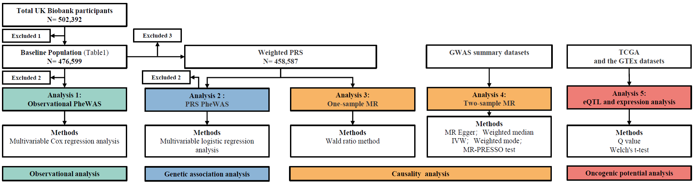

# **Psoriasis study**
This directory holds the source code needed for the manuscript: 
Ruolin Li, Wenjin Luo, et al.Association between psoriasis and risk of malignancy: observational and genetic investigations

Affiliation: The First Affiliated Hospital of Chongqing Medical University, Chongqing, China
****

## Files
### rcpp_outcome.cpp 
The C++ code defined a parallel processing routine to loop through the matrix and return the result containing the indices and 
dates where the specified ICD code was found.**Note that this file is needed to be placed in include directory of RcppParallel.**

### 00_Outcome_file_extraction.R
The R script extracted cancer outcomes from raw UK Biobank ICD10 diagnoses data with C++ functions defined above.

### 01_Psoriasis_and_PRS_phewas.R
The R script conducted comprehensive Phewas analysis using parallel processing and detailed summaries of survival and logistic 
regression results were provided.

### 02_Manhattan_plot.R
The R script was used to generate and save Manhattan plots for psoriasis and PRS phewas

### 03_One_sample_mr.R
The R script performed one-sample Mendelian Randomization analysis by the two-step logistic regression model.The detailed 
principle of the model was derived from:"Burgess, S., & Thompson, S. G. (2021). Mendelian Randomization: Methods for Causal 
Inference Using Genetic Variants. Chapman and Hall/CRC."

### 04_Two_sample_mr.R
The R script executed the two-sample Mendelian Randomization analysis with the 'TwoSampleMR' package.
